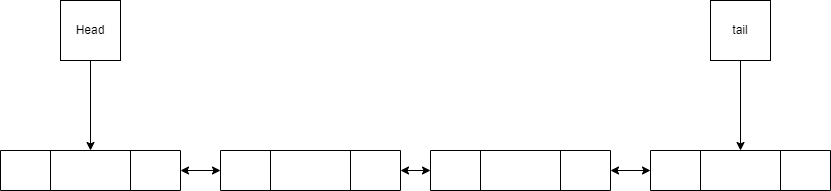
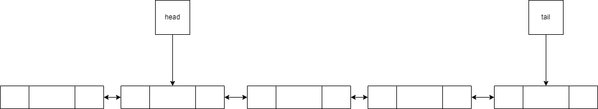
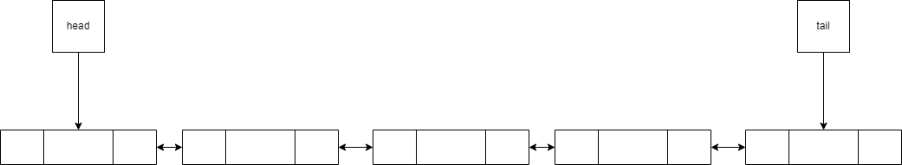
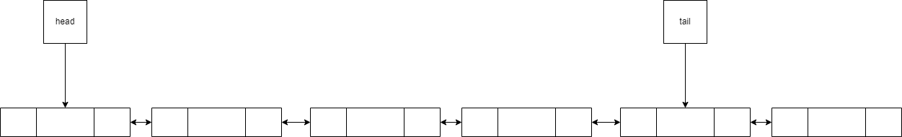
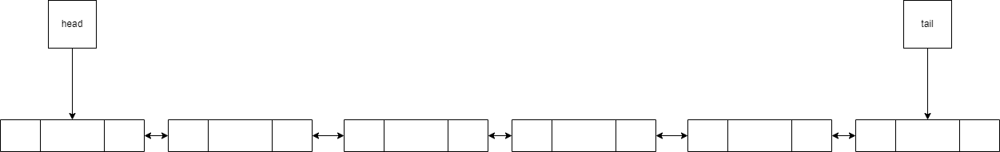
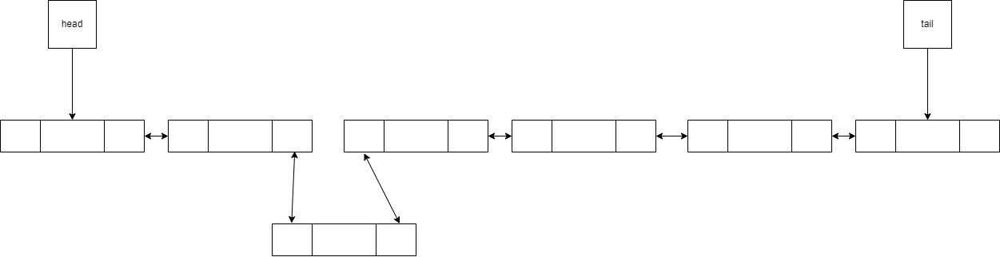
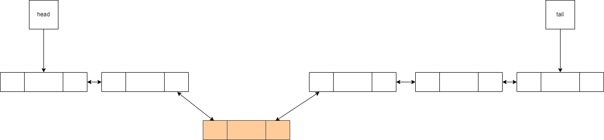

# Double Linked List

과제 참고 자료입니다.

## 구조

1. 첫 노드와 마지막 노드의 위치를 저장하는 head, tail 이 있다고 가정한다.
2. 각 노드는 자신의 이전 노드, 다음 노드의 위치를 저장하고 있다.

현재 이중 연결 리스트의 상태가 다음과 같다고 하자.

## Push
먼저 head, 리스트의 맨 앞에 데이터를 삽입하는 과정이다.

데이터를 저장한 노드를 만들고 head와 연결한다.

그 뒤, head를 새로 만든 노드로 바꾸면 된다.

맨 뒤의 삽입하는 과정은 전과 매우 유사하다.

데이터를 저장한 노드를 만들고 tail과 연결한다.

그 뒤, tail를 새로 만든 노드로 바꾸면 된다.

## insert

1. k 번째 위치에(head 가 가리키는 노드를 0번째라 가정) 데이터를 삽입한다면 현재 list에 있는 k 번째 노드를 찾는다. 

2. 단일 연결 리스트와 유사하게 진행하되, 새로운 노드와 `k-1`번째 노드도 연결하는 것이 추가된다.

아래는 2번째 위치에 데이터를 삽입하는 케이스이다.

단일 연결 리스트의 경우, k-1번째 노드의 위치도 알아야 했지만 이중 연결 리스트는 k 번째 노드만 알고 있다면 이전 노드의 위치도 바로 알 수 있으므로, 단일 연결 리스트와 달리 이전 노드를 저장할 필요가 없다.

## delete 

1. 현재 list에 있는 k 번째 노드를 찾는다. 

2. `k-1`번째 노드와 `k+1` 번째 노드를 서로 연결한다.
    1. 만약 tail 이나 head 노드를 삭제한다면 단일 연결 리스트와 같이 head와 tail을 갱신한다.

만약 2번째 노드를 삭제한다면 2번째 노드를 먼저 찾는다.

그 후, 1번째 노드와 3번째 노드를 연결한다.

